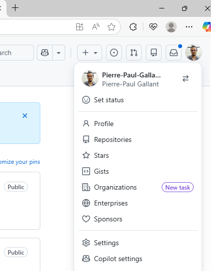
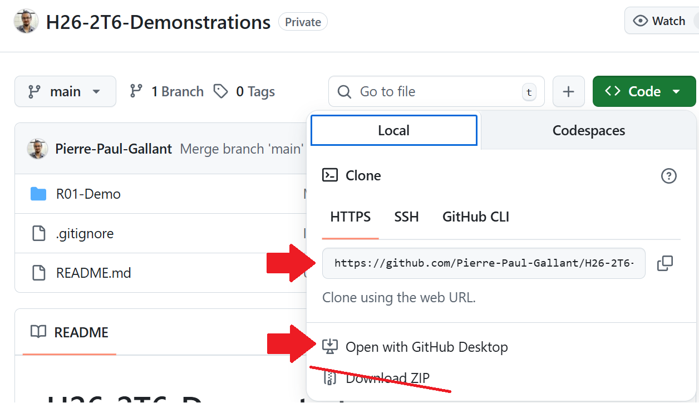

---
## Cloner sur une machine local
### À partir d'un devoir GitHub Classroom existant.
Cloner une dépôt consiste à copier tout le code du dépôt sur notre machine local, ainsi que tous les commits ayant été effectuer précédament.
À partir du site web GitHub.com :

<Row>

    <Column>

    - Cliquez sur le menu de navigation utilisateur en haut à droit et aller dans la section "Organizations".
    - Trouvez l'organisation de votre cours (H26-2T6).
    - Sélectionnez l'onglet "Repositories"
    - Sélectionnez le dépôt à cloner.

    :::info
    La raison pour laquelle vous devez sélectionner l'organisation, est parce que vous n'êtes pas réellement le propriétaire du dépôt.

    Il appartient au cours, ce qui permet à votre professeur de suivre votre progrès, ainsi que d'ajouter des actions GitHub tel que l'exécution de tests automatiques.
    :::

    </Column>
    <Column>

    

    </Column>
</Row>

<Row>

    <Column>
    
    - Une fois dans le dépôt, sélectionnez les options de clonage avec le bouton .
    - Vous pouvez copier l'URL du dépôt ou s

    </Column>
    <Column>
    
    
    
    </Column>

</Row>

### À partir d'un dépôt personnel

---
## Commit des modifications

---
## Push

---
## Fetch & Pull

---
## Autres actions GitHub

### Crée un nouveau dépot

### Gérer le .gitignore
---